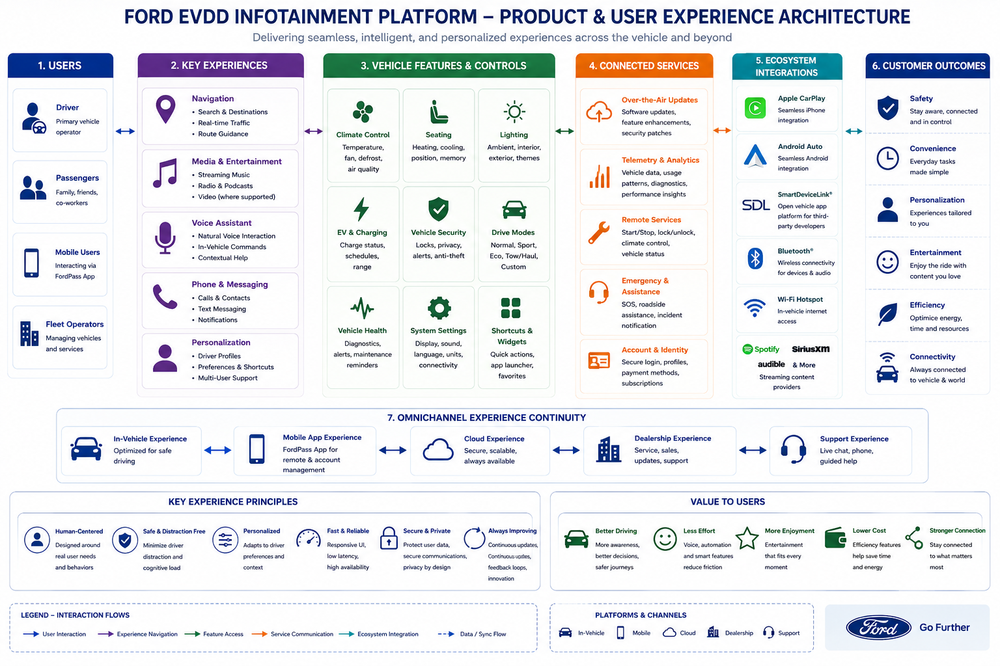
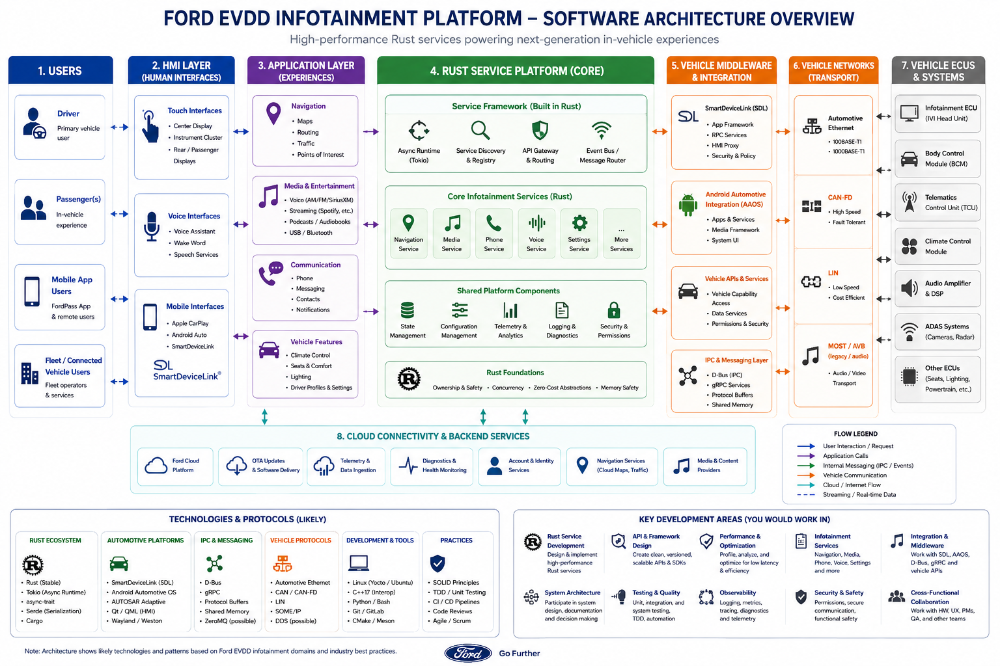
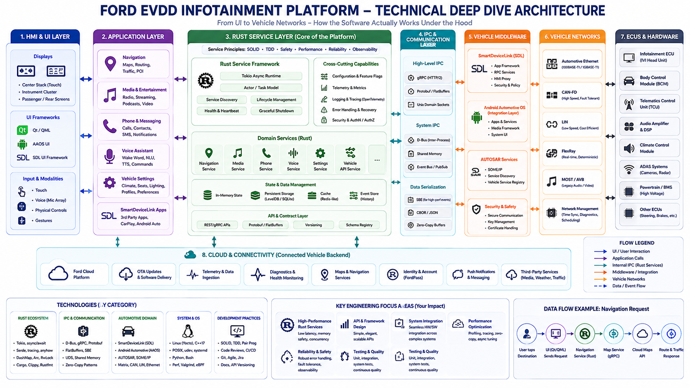
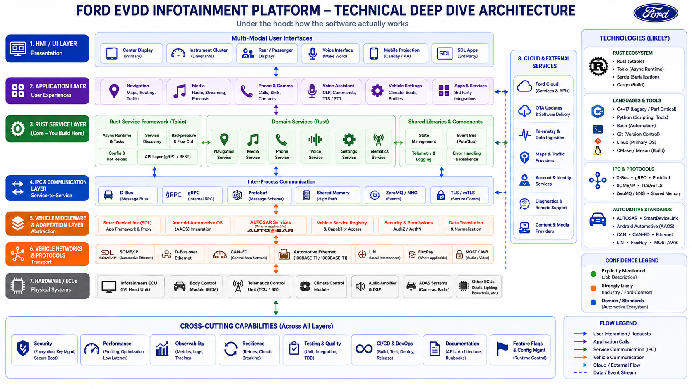
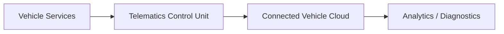

# Architecture

This architecture package describes a public-concept infotainment and connected
vehicle platform suitable for evaluating system design judgment, Rust service
thinking, API boundaries, safety policy, and observability.

The design is based on public automotive concepts and role requirements. It
does not claim to describe Ford internal architecture.

## Architecture Overview

The platform is organized around user-facing HMI surfaces, application
features, Rust domain services, local IPC, vehicle integration boundaries,
vehicle networks, ECUs, TCU connectivity, and cloud services. The main design
principle is separation of responsibility: presentation code should not own
vehicle-control logic, projected phone apps should not directly control ECUs,
and remote commands should pass through explicit authorization, policy,
validation, and acknowledgement paths.

The user experience view frames the product surface: navigation, media, phone,
voice, vehicle settings, charging, diagnostics, and remote services. It matters
because service design should begin with user workflows and safety boundaries,
not with middleware names.

## User Experience Surfaces

The user interacts with the platform through center display HMI, instrument
cluster surfaces, voice, rear/passenger displays, mobile apps, and phone
projection. These surfaces create requests for navigation, media, phone,
climate, charging, vehicle settings, diagnostics, and connected services.

The HMI should depend on stable service APIs instead of embedding business
logic or vehicle-control decisions. That boundary keeps UX evolution, service
behavior, and vehicle integration separately testable.

## Platform Layers

The platform architecture image illustrates a layered model: HMI and
applications above service APIs, IPC and middleware in the middle, and vehicle
networks, ECUs, TCU, and cloud services below. The key design concern is making
each layer's ownership and contract explicit.

The layer model separates:

- HMI and application experiences.
- Rust domain services and shared platform components.
- Local IPC and schema boundaries.
- Vehicle middleware and capability access.
- Vehicle networks and ECUs.
- Cloud services, OTA, diagnostics, and remote workflows.

## Rust Service Layer

Rust fits the domain service layer where reliability, concurrency, latency, and
clear APIs matter. Services can own bounded responsibilities such as command
handling, navigation, media, phone, voice, settings, telemetry, diagnostics,
or lifecycle management.

Strong Rust service boundaries provide:

- Typed command and event APIs.
- Explicit ownership of async tasks and queues.
- Clear error handling and acknowledgement semantics.
- Backpressure-aware routing.
- Health, readiness, telemetry, and diagnostic events.
- Testable separation between parsing, validation, policy, routing, and
  execution.

## Local IPC and Service Boundaries

In-vehicle service communication is a local systems problem. D-Bus, gRPC,
Protobuf, shared memory, event buses, SOME/IP, and AUTOSAR-style service
concepts solve different parts of that problem. The design should distinguish
local deterministic service communication from cloud messaging over unreliable
networks.

gRPC and Protobuf are useful where schema clarity, versioning, and cross-team
or cross-language contracts matter. D-Bus is relevant for Linux local service
integration. Shared memory can support high-throughput paths. Event buses can
decouple producers and consumers when ordering, capacity, and failure semantics
are explicit.

## Vehicle Integration Boundary

Vehicle integration should be mediated through vehicle-owned services and
policy boundaries. The service layer should not expose low-level ECU details to
HMI clients or projected phone applications. Instead, it should translate
domain intent into capability requests that can be authorized, validated,
audited, and rejected safely.

The deep-dive image emphasizes the role of middleware, IPC, vehicle networks,
ECUs, and cross-cutting capabilities. It matters because infotainment services
are not just UI features; they sit inside a safety- and integration-heavy
vehicle platform.

The alternate deep-dive image highlights service framework concerns such as
configuration, service discovery, backpressure, API layers, telemetry, error
handling, resilience, and feature flags. These are the concerns that make a
Rust service platform maintainable across teams.

## BYOD Projection vs Native Vehicle OS

CarPlay and Android Auto are BYOD projection surfaces. The phone owns the app
runtime, user identity, and much of the projected app behavior. The vehicle
owns display integration, audio routing, input handling, safety policy,
driver-distraction boundaries, and access to vehicle systems.

AAOS is different: Android Automotive OS runs natively on the vehicle head
unit. Google built-in / Google Automotive Services, where licensed, are service
layers on top of AAOS. SmartDeviceLink is another phone-to-vehicle app
integration model and should be treated separately from CarPlay, Android Auto,
and AAOS.

## Vehicle-to-Cloud Messaging

Vehicle-to-cloud workflows cover telemetry upload, diagnostics, OTA, remote
commands, fleet services, support tooling, account services, maps, analytics,
and FordPass-style mobile experiences. These workflows must handle cellular
intermittency, buffering, retries, identity, authorization, privacy, and audit
trails.

MQTT is a plausible vehicle-to-cloud messaging pattern because it is common in
connected-device and automotive examples. This repository does not claim Ford
uses MQTT internally. MQTT should not be confused with deterministic local
in-vehicle IPC.

## Safety and Policy Boundaries

Safety and policy boundaries are central to the design. A remote command or HMI
action should not become a vehicle operation until it has passed validation,
authorization, state freshness checks, capability checks, policy decisions, and
auditable routing through vehicle-owned interfaces.

Projected apps should not directly control ECUs. Native services and vehicle
middleware should decide what vehicle state is exposed, which commands are
allowed, and how driver-distraction or safety constraints apply.

## Telemetry, Diagnostics, and Observability

The platform should emit logs, metrics, traces, diagnostic events, command
audit records, correlation IDs, health checks, readiness signals, and OTA
status. Observability should explain both successful and rejected workflows:
accepted, rejected, blocked, expired, executed, failed, and timed out.

Observability also has privacy and bandwidth constraints. The design should
collect enough data to diagnose service and fleet behavior without
over-collecting sensitive user or vehicle information.

## Key Design Tradeoffs

- Local IPC vs vehicle-to-cloud messaging: local services need low-latency
  contracts; cloud paths need durability and tolerance for intermittent
  connectivity.
- BYOD projection vs native vehicle apps: projected apps bring phone-owned
  experiences; native services own vehicle integration and policy.
- Rust service decomposition vs operational complexity: small services improve
  ownership and testing but require strong contracts and observability.
- Schema evolution vs client stability: APIs need versioning and migration
  paths for cross-team integration.
- Telemetry detail vs privacy: diagnostics require signal, but collection must
  be intentional and bounded.

## Appendix: System Design Scenarios

### Connected Vehicle Telemetry Platform

A telemetry platform collects vehicle health, diagnostics, battery, usage, and
service events from vehicle services through a TCU/cloud boundary. The design
must handle intermittent connectivity, buffering, privacy, schema evolution,
fleet-level observability, and separation from command/control paths.

### FordPass-Style Remote Commands

Remote lock, unlock, climate preconditioning, locate, and charge scheduling
commands require authenticated users, authorized vehicles, command IDs,
deadlines, idempotency, vehicle-side policy gates, acknowledgement events, and
audit logs. The detailed design is in
[Remote Command Flow](remote_command_flow.md).

### OTA Campaign Coordination

OTA coordination requires campaign targeting, vehicle eligibility, update
readiness, download state, installation windows, rollback signals, user
notifications, and fleet-level progress reporting. It must avoid interfering
with driving-critical behavior and must preserve a clear audit trail.

### Diagnostics Upload

Diagnostics upload collects service health, trouble context, logs, and
capability state through controlled paths. The design must balance diagnostic
value with privacy, bandwidth, retention, and support workflows.

### In-Vehicle Service Registry

A service registry tracks service identity, version, capability, health, and
readiness. It helps HMI and domain services discover available capabilities
without hard-coding concrete implementations.

### Navigation Request Path

A navigation request flows from HMI to a navigation service, then to vehicle
state, map/traffic services, and route guidance. EV-specific routing may need
battery state, charging constraints, and policy-controlled access to vehicle
state.

### Versioned gRPC API

A versioned gRPC API should define stable request and response schemas, typed
errors, compatibility rules, deprecation windows, and examples for success,
rejection, timeout, and unsupported capability behavior.

### Local Event Bus

A local event bus decouples producers and consumers for command, telemetry,
health, and state events. Capacity, ordering, retry, shutdown, and
backpressure behavior must be explicit.

### Phone Projection Isolation

CarPlay and Android Auto integrations should be isolated from direct vehicle
control. Projection surfaces can participate in display, audio, and input
workflows while vehicle-owned services enforce policy and capability access.
