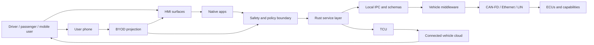

# Connected Vehicle Architecture

This document expands the layered architecture for a public-concept
infotainment and connected vehicle platform. It is written as a standalone
review document and does not claim to describe Ford internal systems.

## HMI and User-Facing Surfaces

The platform begins with user-facing surfaces: center display, instrument
cluster, voice interface, rear/passenger displays, mobile app workflows, and
phone projection. These surfaces expose navigation, media, phone, messaging,
climate, seats, profiles, EV charging, vehicle settings, diagnostics, OTA
status, and remote services.

This image illustrates the breadth of the user experience. It matters because
the service platform must support both visible user workflows and background
vehicle services without mixing presentation code with vehicle-control logic.

## Native Apps and Domain Services

Native vehicle applications depend on domain services for navigation, media,
voice, phone, vehicle settings, charging, diagnostics, telemetry, and account
features. Each service should expose a stable API, own a narrow domain, and
avoid leaking low-level vehicle details to HMI clients.

The application/service split improves testability and integration. HMI code
can evolve independently from service behavior, while services can enforce
validation, policy, observability, and compatibility guarantees.

## BYOD Projection, AAOS, and SmartDeviceLink

| Surface | Runtime owner | Typical role | Boundary |
| --- | --- | --- | --- |
| Apple CarPlay | iPhone | BYOD projection for approved phone apps | Vehicle owns display, audio, input, safety policy, and vehicle access boundaries. |
| Android Auto | Android phone | BYOD projection for Android phone apps | Similar projection boundary to CarPlay. |
| Android Automotive OS | Vehicle head unit | Native in-vehicle OS and app platform | Integrates through vehicle-owned APIs and policy. |
| Google built-in / GAS | Vehicle AAOS plus licensed Google services | Maps, Assistant, Play, and account services where licensed | Cloud/account integration layered onto AAOS. |
| SmartDeviceLink | Phone plus OEM integration layer | OEM-controlled smartphone app integration into HMI | Separate from CarPlay, Android Auto, and AAOS. |

CarPlay and Android Auto should be understood as phone-owned projection
surfaces. AAOS is a native vehicle operating system. SmartDeviceLink is a
separate phone-to-vehicle integration model. In all cases, vehicle-owned safety
and policy boundaries mediate access to vehicle state and capabilities.

## Layered Platform Model

The platform architecture image shows how HMI, services, IPC, middleware,
vehicle networks, ECUs, TCU, and cloud systems fit together. The design keeps
local vehicle integration separate from cloud messaging.

## Rust Services

Rust services are appropriate for the performance-sensitive and
reliability-sensitive service layer. They can provide explicit ownership,
memory safety, concurrency control, typed APIs, and predictable error handling.

Representative Rust service responsibilities:

- Command parsing and validation.
- Navigation, media, phone, voice, settings, telemetry, and diagnostics
  services.
- Async task ownership and lifecycle management.
- Service discovery, health, readiness, and graceful shutdown.
- Backpressure-aware queues and local event routing.
- Typed errors, acknowledgement events, and audit logs.
- Metrics, traces, and diagnostic events.

## Local IPC, gRPC, Protobuf, and D-Bus

Local service communication should use technologies chosen for contract,
latency, language boundary, and platform integration needs.

- D-Bus fits local Linux service integration and capability discovery patterns.
- gRPC provides explicit service APIs and cross-language integration.
- Protobuf provides schema versioning and compatibility discipline.
- Shared memory can support high-throughput data paths.
- Local event buses can support decoupled state and telemetry distribution.
- SOME/IP and AUTOSAR concepts are relevant to vehicle service integration.

The important boundary is conceptual: local IPC is not the same problem as
vehicle-to-cloud messaging.

## Vehicle Middleware, Networks, and ECUs

Vehicle middleware adapts service-level intent into vehicle-owned
capabilities. It enforces permissions, normalizes data, hides low-level network
details, and prevents HMI or projected apps from directly controlling ECUs.

Relevant public concepts include AAOS/VHAL-style vehicle property boundaries,
SmartDeviceLink app framework concepts, AUTOSAR services, SOME/IP, CAN-FD,
Automotive Ethernet, LIN, infotainment ECUs, TCU, body control modules,
battery management, climate modules, ADAS systems, and audio hardware.

The technical deep dive illustrates the integration stack below the application
layer: IPC, middleware, vehicle networks, ECUs, cloud services, and
cross-cutting capabilities such as security, performance, observability,
testing, CI/CD, documentation, and feature flags.

## TCU and Cloud Services

The TCU is the vehicle edge for remote connectivity. It supports telemetry
upload, diagnostics, OTA coordination, remote commands, battery/charging state,
location workflows, support tooling, fleet services, and account-linked mobile
experiences.

Cloud services should handle identity, authorization, routing, buffering,
state aggregation, command acknowledgement, OTA campaign state, diagnostics,
analytics, customer support, and privacy controls.

MQTT is a plausible vehicle-to-cloud messaging pattern, but this repository
does not claim Ford uses MQTT internally. In-vehicle deterministic
communication should be handled as a separate local IPC and vehicle middleware
problem.

## Diagnostics, OTA, and Telemetry

Diagnostics, OTA, and telemetry are cross-cutting platform concerns.

Diagnostics should capture service health, capability state, failure context,
and relevant logs. OTA workflows need eligibility, readiness, download state,
installation state, rollback information, and fleet progress. Telemetry should
include service metrics, command audit records, acknowledgement latency,
policy decisions, error reasons, and correlation IDs.

The design should include privacy and data-minimization controls. Diagnostic
value does not justify unbounded collection.

## Observability Model

Useful observability signals include:

- Service health and readiness.
- Command accepted, rejected, blocked, expired, executed, failed, and timed out.
- Queue depth, dropped messages, retries, and backpressure.
- TCU connectivity state.
- OTA readiness and installation status.
- Diagnostic event counts and severity.
- Correlation IDs across HMI, service, TCU, cloud, and mobile app paths.

## Safety and Policy Model

Safety policy should be explicit and testable. Commands and projected-app
requests pass through vehicle-owned boundaries before they can reach vehicle
capabilities. Policy decisions should consider user authorization, vehicle
state, driver-distraction constraints, capability availability, freshness of
state, command expiry, and duplicate command IDs.

## Confidence Levels

| Confidence | Topics |
| --- | --- |
| Explicit from role | Rust, C++, Linux, Python, Bash, Git, infotainment, HMI, APIs, documentation, testing, Agile. |
| Strong public architecture fit | Tokio-style async services, D-Bus, gRPC, Protobuf, AAOS, SmartDeviceLink, service discovery, telemetry. |
| Automotive ecosystem context | CAN-FD, Automotive Ethernet, SOME/IP, AUTOSAR, TCU, ECU integration, OTA, diagnostics. |
| Plausible cloud pattern | MQTT for vehicle-to-cloud eventing, not deterministic in-vehicle IPC. |
