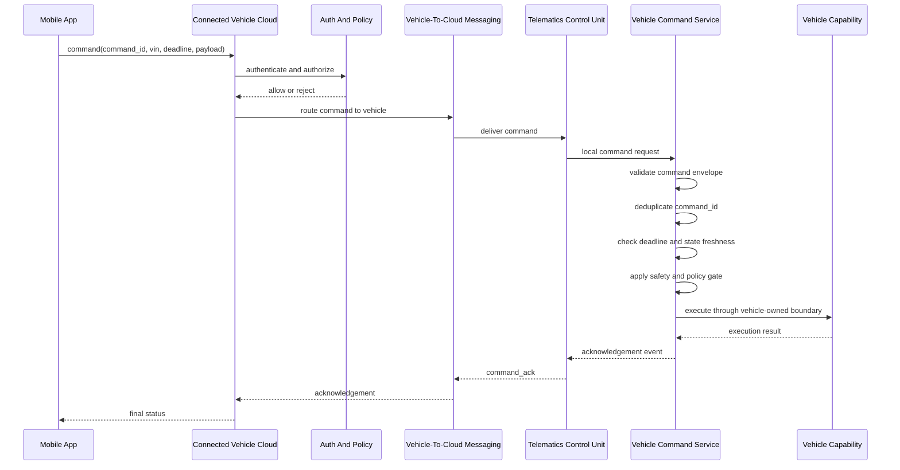

# Remote Command Flow

This document describes a FordPass-style remote command design using public
connected vehicle concepts. It does not claim to describe Ford internal
implementation.

## Design Overview

Remote commands such as lock, unlock, climate preconditioning, vehicle locate,
and charge scheduling cross mobile, cloud, TCU, vehicle service, policy, and
capability boundaries. The workflow must protect against unauthorized access,
duplicate execution, stale commands, unsafe vehicle state, intermittent
connectivity, and ambiguous user feedback.

## Command Creation

A mobile or cloud client creates a command with a stable envelope:

```text
command_id
vin
command_type
source
issued_at
deadline
payload
correlation_id
schema_version
```

`command_id` supports idempotency. `deadline` prevents stale execution.
`source` and `vin` support authorization and audit. `correlation_id` connects
logs and telemetry across mobile, cloud, TCU, and vehicle services.

## Authentication and Authorization

Authentication identifies the user, service, or device submitting the command.
Authorization determines whether that identity can perform the requested action
on the target vehicle. Authorization should consider account ownership,
vehicle association, command type, region, policy, fraud signals, and
capability availability.

An authorization denial should produce a clear rejected status without routing
the command to the vehicle.

## End-to-End Sequence



## Idempotency and Expiry

Remote command systems must assume retries. A duplicate `command_id` should not
execute the same vehicle action twice. The service can return the original
result, reject the duplicate, or return an idempotent acknowledgement depending
on the command type and retained state.

Deadlines prevent delayed commands from executing after the user intent has
expired. A climate preconditioning command that arrives too late should be
expired rather than executed blindly.

## Vehicle-Side Safety Validation

Vehicle-side validation separates well-formed commands from allowed commands.
A command can be syntactically valid but unsafe under current conditions.

Policy checks include:

- Vehicle state permits the action.
- State freshness is acceptable.
- Required capability is present and ready.
- Driver-distraction or safety constraints allow the action.
- Command has not expired.
- Command ID has not already been processed.

## Acknowledgement Events

Acknowledgements should distinguish:

- Accepted by cloud.
- Rejected by authentication or authorization.
- Delivered to vehicle.
- Rejected by validation.
- Blocked by safety policy.
- Expired before execution.
- Executed successfully.
- Failed during execution.
- Timed out waiting for vehicle acknowledgement.

The user experience should distinguish "request accepted" from "vehicle state
changed." A lock command is not complete until the vehicle confirms the final
state or reports an explicit failure.

## Telemetry and Audit Trail

The audit trail should capture command ID, VIN, command type, source, deadline,
policy decision, execution result, acknowledgement status, latency, and
correlation IDs. Telemetry should support diagnostics and customer support
while minimizing sensitive data collection.

Metrics should include command latency, rejection rates, duplicate counts,
expiry counts, policy blocks, TCU connectivity state, and acknowledgement
timeouts.

## Vehicle-to-Cloud Messaging

Remote commands cross unreliable networks, so cloud routing must account for
timeouts, retries, delayed delivery, buffering, and partial failure. MQTT or a
similar publish/subscribe system is a plausible vehicle-to-cloud messaging
pattern. This is not a claim about Ford internal infrastructure.

Inside the vehicle, command delivery should use local IPC and vehicle-owned
services rather than cloud messaging concepts. D-Bus, gRPC/Protobuf, event
buses, SOME/IP, or AAOS/VHAL-style boundaries are more relevant to local
integration.

## Command Examples

### Lock and Unlock

Lock and unlock commands require user authorization, command ID deduplication,
door/vehicle state checks, deadline validation, execution through a
vehicle-owned boundary, and an acknowledgement that distinguishes requested
from confirmed state.

### Climate Preconditioning

Climate preconditioning depends on capability availability, battery or energy
state, vehicle state, user settings, and expiry. A stale command should be
expired rather than executed after the useful window has passed.

### Vehicle Locate

Vehicle locate requires identity, authorization, privacy controls, location
freshness, and clear status when the vehicle is offline or location data is not
available.

### Charge Scheduling

Charge scheduling requires time-window validation, battery/charging capability
state, user preferences, and acknowledgements that distinguish schedule
accepted from schedule applied.

## Failure Modes

- Cellular connectivity is unavailable or intermittent.
- Command arrives after its deadline.
- Duplicate command is retried by cloud or mobile clients.
- Vehicle state is stale or unavailable.
- Policy blocks execution because vehicle state is unsafe.
- Local service or receiver is unavailable.
- Vehicle capability returns a failure.
- Acknowledgement is lost after execution.
- Cloud, TCU, and vehicle disagree about the last known status.

## Design Tradeoffs

- Fast user feedback vs confirmed final state.
- Retry robustness vs duplicate execution risk.
- Generic command envelopes vs command-specific safety policy.
- Detailed diagnostics vs privacy and retention constraints.
- Cloud routing flexibility vs local vehicle-owned execution control.
