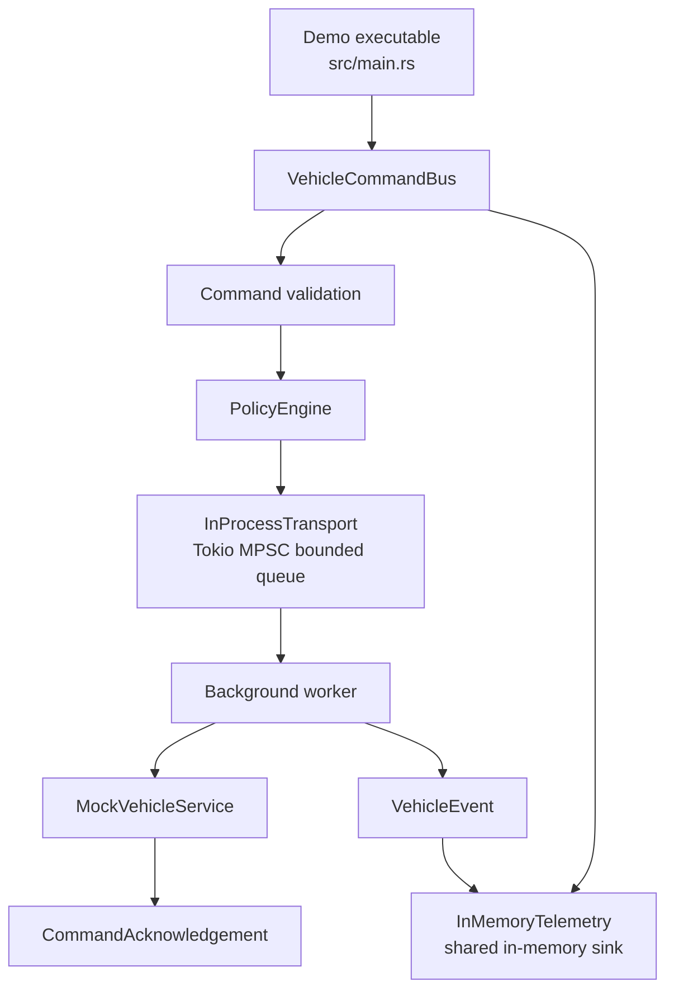
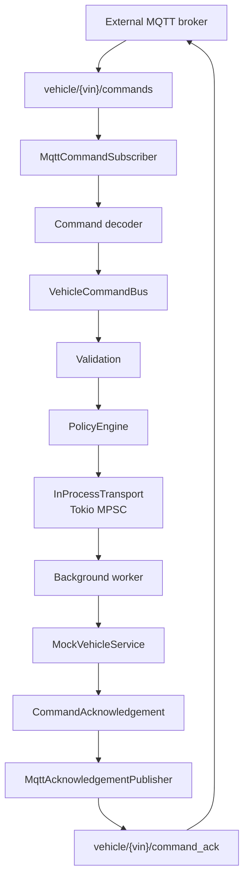
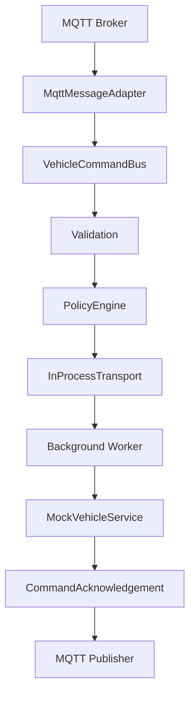

# Vehicle Command/Event Service Bus Design

This document describes the implemented Phase 1 Rust prototype. The prototype
is a small, reviewable service-bus example rather than a production vehicle
platform.

## Prototype Overview

The service accepts typed vehicle commands, validates them, checks policy,
routes allowed commands through an in-process transport, executes them through
a mock vehicle service, returns command acknowledgements, and records domain
events in shared in-memory telemetry.

The implementation runs locally without Docker, MQTT, a broker, or any network
server. MQTT remains a Phase 2 transport adapter option around the same
architecture, not a Phase 1 dependency and not a replacement for the service
bus.

## Canonical Phase 1 Architecture



`src/main.rs` is only a demo executable. `VehicleCommandBus` owns command
orchestration. Validation and policy happen before transport. The
`InProcessTransport` uses Tokio MPSC for in-process async messaging with a
bounded queue. The background worker executes commands with
`MockVehicleService`. `CommandAcknowledgement` returns the command outcome.
`VehicleEvent` records lifecycle events, and `InMemoryTelemetry` stores those
events in a shared in-memory sink.

## Phase 1 Architecture Status

Phase 1 is complete.

The implemented architecture includes:

- Local-first execution with `cargo test` and `cargo run`.
- Rust 2024 edition.
- Library-first architecture.
- No Docker requirement.
- No MQTT dependency.
- No network server or broker.
- Typed command model.
- Command validation.
- Policy engine.
- `InProcessTransport` using bounded Tokio MPSC.
- `BusMessage` for typed transport messages.
- `oneshot` acknowledgement channels.
- `VehicleCommandBus` service bus.
- Background worker model.
- `MockVehicleService`.
- `CommandAcknowledgement`.
- `VehicleEvent` and `VehicleEventKind`.
- Shared `InMemoryTelemetry`.
- Thin demonstration executable.
- Passing unit and integration tests.

## Design Principles

- Library-first: reusable business logic lives in `src/lib.rs` and the modules
  it exports.
- Thin executable: `src/main.rs` demonstrates the library and must not own
  command, policy, transport, acknowledgement, service, or telemetry logic.
- Typed APIs: commands, acknowledgements, telemetry events, and errors are
  explicit Rust types.
- Safety gate first: validation and policy run before commands reach the mock
  vehicle service.
- Bounded async routing: the in-process queue has explicit capacity and send
  failures are typed outcomes.
- Observable behavior: lifecycle events are recorded as `VehicleEvent` values
  in `InMemoryTelemetry`.
- Broker-free tests: the default test path has no Docker, MQTT, broker, or
  network dependency.

## Module Design

| Module | Responsibility |
| --- | --- |
| `src/lib.rs` | Library entry point exporting reusable prototype modules for tests and executables. |
| `src/main.rs` | Thin demonstration executable; Phase 2 can evolve it into a `clap` CLI while business logic remains in the library. |
| `src/command.rs` | `CommandType`, `Command`, command construction, expiry helper, and command validation. |
| `src/error.rs` | `CommandError` variants for validation, policy, bus send, service, and acknowledgement failures. |
| `src/event.rs` | `CommandAcknowledgement` and `CommandStatus` types used to report command outcomes. |
| `src/policy.rs` | `VehicleState` and `PolicyEngine`; tracks duplicate command IDs and blocks unsafe unlock while moving. |
| `src/service_bus.rs` | `VehicleCommandBus`, `MockVehicleService`, background worker orchestration, acknowledgement handling, and telemetry recording. |
| `src/telemetry.rs` | `VehicleEvent`, `VehicleEventKind`, and shared `InMemoryTelemetry` backed by `Arc<Mutex<Vec<VehicleEvent>>>`. |
| `src/transport.rs` | `BusMessage` and `InProcessTransport` using bounded Tokio MPSC plus oneshot acknowledgement channels. |

## Library-First Architecture

The prototype is intentionally library-first.

`src/lib.rs` exports the reusable modules used by tests and by the
demonstration executable. `src/main.rs` is intentionally thin: it builds a
`VehicleCommandBus`, submits a sample command, prints the returned
`CommandAcknowledgement`, and prints recorded telemetry.

Phase 2 may evolve `main.rs` into a `clap` CLI for demos, command submission,
and optional transport adapter exercises. Business logic must not move into
`main.rs`; the CLI should call the library.

## Command Model

The command envelope carries enough information for validation, policy,
correlation, acknowledgement, and telemetry:

```text
Command {
    command_id
    vehicle_id
    command_type
    issued_at
    deadline
}
```

Implemented Phase 1 command types:

- `LockDoors`.
- `UnlockDoors`.
- `RequestVehicleHealth`.

Validation rejects:

- Empty `command_id`.
- Empty `vehicle_id`.
- Expired deadlines.

## Policy Model

The policy layer decides whether a valid command is allowed under current mock
vehicle state.

Implemented Phase 1 policy behavior:

- Reject duplicate `command_id` values.
- Block `UnlockDoors` while the mock vehicle is moving.
- Record allowed command IDs so later submissions can be treated
  deterministically as duplicates.

Validation remains separate from policy. Expired or malformed commands are
validation failures; unsafe commands are policy failures.

## Transport Design

The current transport boundary is concrete and local:

```text
Command
    ↓
BusMessage
    ↓
InProcessTransport::publish(...)
    ↓
tokio::sync::mpsc::Sender<BusMessage>
```

`InProcessTransport::new(capacity)` creates a bounded Tokio MPSC channel and
returns the transport plus its receiver. Bounded queues provide natural
backpressure and avoid unbounded memory growth during local tests and demos.

`BusMessage` contains:

- the typed `Command`.
- a `tokio::sync::oneshot::Sender<CommandAcknowledgement>`.

The oneshot channel lets the worker return one acknowledgement for the command
without introducing a network protocol or broker.

Tokio MPSC was chosen for Phase 1 because it demonstrates async message
passing, ownership, bounded behavior, receiver shutdown, and testable failure
handling while keeping the core service path strongly typed and local.

## Service Bus Design

`VehicleCommandBus` owns the Phase 1 command path:

1. Record `VehicleEventKind::CommandReceived`.
2. Validate the command.
3. Evaluate policy.
4. Create a `BusMessage` and acknowledgement receiver.
5. Publish through `InProcessTransport`.
6. Record `VehicleEventKind::CommandRouted`.
7. Await the `CommandAcknowledgement` from the worker.

Validation failures return rejected acknowledgements. Policy failures return
rejected or blocked acknowledgements depending on the error. Transport send
failures return failed acknowledgements.

## Background Worker

The background worker is spawned by `VehicleCommandBus::new`.

The worker:

- receives `BusMessage` values from the Tokio MPSC receiver.
- executes the command through `MockVehicleService`.
- creates an executed or failed `CommandAcknowledgement`.
- records `VehicleEventKind::CommandExecuted` on success.
- records `VehicleEventKind::AcknowledgementEmitted`.
- sends the acknowledgement through the message's oneshot sender.

`MockVehicleService` is intentionally small. It succeeds for normal command
IDs and returns `CommandError::ServiceUnavailable` when a command ID contains
`fail`, giving tests and demos a deterministic service-failure path.

## Event And Telemetry Model

Telemetry is not the event itself.

`VehicleEvent` represents a domain event. `VehicleEventKind` names the event
type. `InMemoryTelemetry` records `VehicleEvent` values in shared memory using
`Arc<Mutex<Vec<VehicleEvent>>>`, allowing the service bus and background
worker to write to the same sink.

Implemented event kinds:

- `CommandReceived`.
- `ValidationRejected`.
- `PolicyBlocked`.
- `CommandRouted`.
- `AcknowledgementEmitted`.
- `CommandExecuted`.
- `BusSendFailed`.
- `ReceiverDropped`.

The current telemetry model is deterministic and test-friendly. It is not a
production logging, tracing, metrics, or persistence system.

## Error Handling

Typed errors are defined in `CommandError`:

- `MissingCommandId`.
- `MissingVehicleId`.
- `Expired`.
- `UnsafeState`.
- `Duplicate`.
- `BusSendFailed`.
- `ServiceUnavailable`.
- `AckFailed`.

Typed errors make tests precise and keep downstream callers from parsing
strings to understand behavior.

## Local Execution Model

The local developer path is:

```text
cargo test
cargo run
```

`cargo test` and `cargo run` require no broker, Docker, MQTT client, MQTT
server, or network service.

## Testing Strategy

The current test suite covers:

- Command construction.
- Missing command ID rejection.
- Missing vehicle ID rejection.
- Expired command rejection.
- Acknowledgement construction.
- Duplicate command rejection.
- Unsafe unlock while moving blocked by policy.
- `InProcessTransport` publish behavior.
- Receiver-drop send failure behavior.
- End-to-end service bus execution.
- Expired command rejection before transport.
- Unsafe command blocking before transport.
- Duplicate command rejection through the service bus.
- Telemetry lifecycle recording.
- Direct `InMemoryTelemetry` recording.

## Future Extension Points

Phase 2 extends Phase 1 rather than replacing it.

| Component | Phase 1 | Phase 2+ |
| --- | --- | --- |
| External transport | None | MQTT adapter using `rumqttc` |
| Internal transport | `InProcessTransport` using Tokio MPSC | Still retained for in-application routing |
| Vehicle service | `MockVehicleService` | Real or simulated vehicle subsystem adapter |
| Telemetry | `InMemoryTelemetry` | `tracing`, OpenTelemetry, MQTT telemetry topic |
| Executable | Minimal `main.rs` demo | `clap` CLI |
| Serialization | None required | JSON command and acknowledgement payloads |
| Broker | None | External local broker such as Mosquitto or EMQX |
| Tests | Broker-free integration tests | Optional broker-backed integration tests |

## Phase 2: MQTT Adapter Extension

Recommended Phase 2: MQTT adapter around the existing service bus.

MQTT can be added without changing the core command flow. MQTT represents an
external integration boundary around the existing architecture.

MQTT must not replace:

- `VehicleCommandBus`.
- command validation.
- `PolicyEngine`.
- `InProcessTransport`.
- background worker.
- `CommandAcknowledgement`.
- `VehicleEvent`.
- `InMemoryTelemetry`.

MQTT should wrap the current architecture by converting external topic
messages into internal `Command` values and publishing resulting
acknowledgements back to MQTT.



Broker decision:

- Use an external local broker first.
- Recommended local broker: Mosquitto or EMQX.
- Recommended Rust client: `rumqttc`.
- Do not build a Rust MQTT broker/server in Phase 2.
- `mqtt-endpoint-tokio` remains future research only if server-side MQTT
  behavior becomes an explicit goal.
- Broker-backed tests should be opt-in. Phase 1 tests must continue to pass
  without a broker.

## Phase 2 Slice 1

Slice 1 introduces the first MQTT-facing implementation boundary while keeping
the completed Phase 1 architecture as the system core. MQTT is an external
integration boundary. It must not replace `VehicleCommandBus`, command
validation, `PolicyEngine`, `InProcessTransport`, the background worker,
`CommandAcknowledgement`, `VehicleEvent`, or `InMemoryTelemetry`.

Slice 1 introduces three concepts.

### JSON Serialization

Commands and acknowledgements become serializable using `serde`. This allows
the existing typed `Command` and `CommandAcknowledgement` models to cross a
process boundary without changing the internal command path.

Serialization should be added to the domain types that need to cross the MQTT
boundary. It should not change validation, policy, service bus routing, worker
execution, acknowledgement status semantics, or telemetry recording.

### MQTT Topic Model

Slice 1 introduces the MQTT topic taxonomy:

```text
vehicle/{vin}/commands
vehicle/{vin}/command_ack
vehicle/{vin}/telemetry
```

These topics should initially be represented by helper functions rather than
hard-coded strings. Topic helpers keep VIN interpolation and topic naming
consistent across subscribers, publishers, tests, and future CLI code.

### MQTT Adapter Boundary

Slice 1 adds an adapter layer around the existing service bus:

```text
External MQTT Broker
        |
        v
MqttMessageAdapter
        |
VehicleCommandBus
```

`MqttMessageAdapter` converts MQTT-shaped payloads into existing `Command`
objects and passes them to `VehicleCommandBus`. No business logic should move
into the adapter. Validation, policy, internal routing, worker execution,
acknowledgements, events, and telemetry remain owned by the Phase 1 core.

`MqttTransport` is reserved for Slice 2, when `rumqttc` is introduced and the
code performs actual broker communication.



## CLI Evolution

Phase 2 can evolve the thin demonstration executable into a `clap` CLI for:

- running local demos.
- submitting commands.
- selecting optional transport adapters.
- printing acknowledgements and telemetry.

The CLI must stay as an executable wrapper around the library. It should not
become the owner of domain logic.

## Phase 1 Summary

Phase 1 implements a local-first Rust 2024 command/event service bus with a
typed command model, validation, policy, bounded Tokio MPSC transport,
`BusMessage`, background worker, mock vehicle service, oneshot
acknowledgements, shared in-memory telemetry, a thin demonstration executable,
and passing tests.

## Non-Goals

- No Ford internal architecture model.
- No real vehicle, ECU, TCU, cloud, AAOS, CarPlay, Android Auto, or
  SmartDeviceLink integration.
- No MQTT client, MQTT broker, broker hardening, clustering, TLS,
  authentication, or authorization in Phase 1.
- No real D-Bus, gRPC, Protobuf, CAN, or Automotive Ethernet.
- No persistent database.
- No production authentication.
- No UI.
- No broad service framework.
