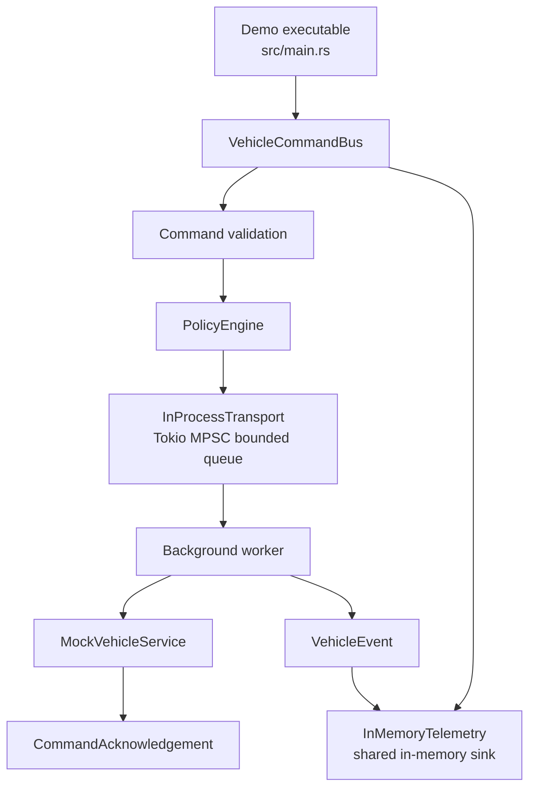
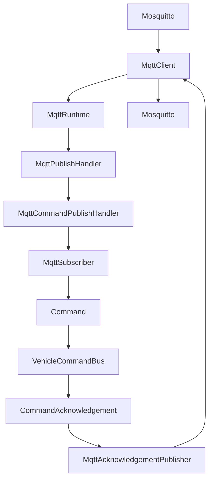
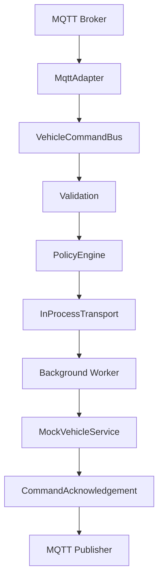
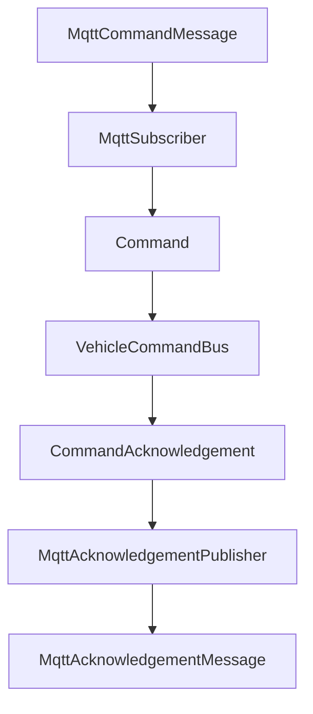

# Vehicle Command/Event Service Bus Design

This document describes the implemented Phase 1 Rust prototype. The prototype
is a small, reviewable service-bus example rather than a production vehicle
platform.

## Reviewer Guide

This document describes the architecture: command flow, validation, policy,
transport boundaries, telemetry, the MQTT demo path, and future transport/codec
extension points.

It is relevant because it shows the design decisions behind the prototype and
why Phase 2 extends the Phase 1 service bus instead of replacing it.

Read next:

- [Coding README](README.md) for the prototype overview and status.
- [Implementation](IMPLEMENTATION.md) for completed slices and test coverage.
- [Build Plan](../../INFOTAINMENT_BUILD.md) for the repository timeline.

## Prototype Overview

The service accepts typed vehicle commands, validates them, checks policy,
routes allowed commands through an in-process transport, executes them through
a mock vehicle service, returns command acknowledgements, and records domain
events in shared in-memory telemetry.

The default core path runs locally without Docker, broker communication, or any
network server. The optional MQTT demo connects to a local Mosquitto broker
while preserving the same service-bus architecture. MQTT wraps the service bus;
it does not replace it.

## Canonical Phase 1 Architecture



`src/main.rs` is only a demo executable. `VehicleCommandBus` owns command
orchestration. Validation and policy happen before transport. The
`InProcessTransport` uses Tokio MPSC for in-process async messaging with a
bounded queue. The background worker executes commands with
`MockVehicleService`. `CommandAcknowledgement` returns the command outcome.
`VehicleEvent` records lifecycle events, and `InMemoryTelemetry` stores those
events in a shared in-memory sink.

## Phase 1 Architecture Status

Phase 1 is complete.

The implemented architecture includes:

- Local-first execution with `cargo test` and `cargo run`.
- Rust 2024 edition.
- Library-first architecture.
- No Docker requirement.
- No broker requirement for default tests and core demo.
- Typed command model.
- Command validation.
- Policy engine.
- `InProcessTransport` using bounded Tokio MPSC.
- `BusMessage` for typed transport messages.
- `oneshot` acknowledgement channels.
- `VehicleCommandBus` service bus.
- Background worker model.
- `MockVehicleService`.
- `CommandAcknowledgement`.
- `VehicleEvent` and `VehicleEventKind`.
- Shared `InMemoryTelemetry`.
- Thin demonstration executable.
- JSON serialization.
- MQTT topic model.
- `rumqttc` client wrapper.
- `MqttTransport` subscribe and publish helpers.
- `MqttRuntime`.
- `MqttPublishHandler`.
- `MqttCommandPublishHandler`.
- MQTT command decoding.
- MQTT submission into `VehicleCommandBus`.
- MQTT acknowledgement encoding.
- Live Mosquitto demo executable.
- Ignored broker smoke and runtime tests.
- Passing unit and integration tests.

## Design Principles

- Library-first: reusable business logic lives in `src/lib.rs` and the modules
  it exports.
- Thin executable: `src/main.rs` demonstrates the library and must not own
  command, policy, transport, acknowledgement, service, or telemetry logic.
- Typed APIs: commands, acknowledgements, telemetry events, and errors are
  explicit Rust types.
- Safety gate first: validation and policy run before commands reach the mock
  vehicle service.
- Bounded async routing: the in-process queue has explicit capacity and send
  failures are typed outcomes.
- Observable behavior: lifecycle events are recorded as `VehicleEvent` values
  in `InMemoryTelemetry`.
- Broker-free defaults: the default test path has no Docker, broker, or network
  dependency.
- MQTT as adapter: live MQTT code translates broker publishes into existing
  commands and acknowledgements without moving business logic out of the service
  bus.

## Module Design

| Module | Responsibility |
| --- | --- |
| `src/lib.rs` | Library entry point exporting reusable prototype modules for tests and executables. |
| `src/main.rs` | Thin demonstration executable; Phase 2 can evolve it into a `clap` CLI while business logic remains in the library. |
| `src/command.rs` | `CommandType`, `Command`, command construction, expiry helper, and command validation. |
| `src/error.rs` | `CommandError` variants for validation, policy, bus send, service, and acknowledgement failures. |
| `src/event.rs` | `CommandAcknowledgement` and `CommandStatus` types used to report command outcomes. |
| `src/command_transport.rs` | `CommandTransport` abstraction for command submission boundaries. |
| `src/policy.rs` | `VehicleState` and `PolicyEngine`; tracks duplicate command IDs and blocks unsafe unlock while moving. |
| `src/service_bus.rs` | `VehicleCommandBus`, `MockVehicleService`, background worker orchestration, acknowledgement handling, and telemetry recording. |
| `src/telemetry.rs` | `VehicleEvent`, `VehicleEventKind`, and shared `InMemoryTelemetry` backed by `Arc<Mutex<Vec<VehicleEvent>>>`. |
| `src/transport.rs` | `BusMessage` and `InProcessTransport` using bounded Tokio MPSC plus oneshot acknowledgement channels. |
| `src/mqtt/mod.rs` | MQTT module entry point exporting topic, adapter, client, subscriber, publisher, command-flow, and transport helpers. |
| `src/mqtt/topics.rs` | MQTT topic naming helpers for command, acknowledgement, and telemetry topics. |
| `src/mqtt/adapter.rs` | JSON encoding and decoding between MQTT-shaped payloads and existing domain models. |
| `src/mqtt/client.rs` | `MqttClient` construction, publish helper, and receive helper around `rumqttc`. |
| `src/mqtt/subscriber.rs` | Command message decoder that turns `MqttCommandMessage` values into existing `Command` values. |
| `src/mqtt/publisher.rs` | Acknowledgement encoder that turns `CommandAcknowledgement` values into `MqttAcknowledgementMessage` values. |
| `src/mqtt/command_flow.rs` | MQTT-shaped command flow from inbound command message through `VehicleCommandBus` to outbound acknowledgement message. |
| `src/mqtt/handler.rs` | Publish handler trait used by the MQTT runtime. |
| `src/mqtt/command_handler.rs` | Command publish handler for live MQTT publishes, bus submission, and acknowledgement encoding. |
| `src/mqtt/runtime.rs` | Runtime helper that dispatches one received MQTT publish to a handler. |
| `src/mqtt/transport.rs` | MQTT transport wrapper around `MqttClient` with command subscription and acknowledgement/telemetry publish helpers. |
| `examples/mqtt_demo.rs` | Live Mosquitto demonstration executable. |

## Library-First Architecture

The prototype is intentionally library-first.

`src/lib.rs` exports the reusable modules used by tests and by the
demonstration executable. `src/main.rs` is intentionally thin: it builds a
`VehicleCommandBus`, submits a sample command, prints the returned
`CommandAcknowledgement`, and prints recorded telemetry.

Phase 2 may evolve `main.rs` into a `clap` CLI for demos, command submission,
and optional transport adapter exercises. Business logic must not move into
`main.rs`; the CLI should call the library.

## Command Model

The command envelope carries enough information for validation, policy,
correlation, acknowledgement, and telemetry:

```text
Command {
    command_id
    vehicle_id
    command_type
    issued_at
    deadline
}
```

Implemented Phase 1 command types:

- `LockDoors`.
- `UnlockDoors`.
- `RequestVehicleHealth`.

Validation rejects:

- Empty `command_id`.
- Empty `vehicle_id`.
- Expired deadlines.

## Policy Model

The policy layer decides whether a valid command is allowed under current mock
vehicle state.

Implemented Phase 1 policy behavior:

- Reject duplicate `command_id` values.
- Block `UnlockDoors` while the mock vehicle is moving.
- Record allowed command IDs so later submissions can be treated
  deterministically as duplicates.

Validation remains separate from policy. Expired or malformed commands are
validation failures; unsafe commands are policy failures.

## Transport Design

The current transport boundary is concrete and local:

```text
Command
    ↓
BusMessage
    ↓
InProcessTransport::publish(...)
    ↓
tokio::sync::mpsc::Sender<BusMessage>
```

`InProcessTransport::new(capacity)` creates a bounded Tokio MPSC channel and
returns the transport plus its receiver. Bounded queues provide natural
backpressure and avoid unbounded memory growth during local tests and demos.

`BusMessage` contains:

- the typed `Command`.
- a `tokio::sync::oneshot::Sender<CommandAcknowledgement>`.

The oneshot channel lets the worker return one acknowledgement for the command
without introducing a network protocol or broker.

Tokio MPSC was chosen for Phase 1 because it demonstrates async message
passing, ownership, bounded behavior, receiver shutdown, and testable failure
handling while keeping the core service path strongly typed and local.

## Service Bus Design

`VehicleCommandBus` owns the Phase 1 command path:

1. Record `VehicleEventKind::CommandReceived`.
2. Validate the command.
3. Evaluate policy.
4. Create a `BusMessage` and acknowledgement receiver.
5. Publish through `InProcessTransport`.
6. Record `VehicleEventKind::CommandRouted`.
7. Await the `CommandAcknowledgement` from the worker.

Validation failures return rejected acknowledgements. Policy failures return
rejected or blocked acknowledgements depending on the error. Transport send
failures return failed acknowledgements.

## Background Worker

The background worker is spawned by `VehicleCommandBus::new`.

The worker:

- receives `BusMessage` values from the Tokio MPSC receiver.
- executes the command through `MockVehicleService`.
- creates an executed or failed `CommandAcknowledgement`.
- records `VehicleEventKind::CommandExecuted` on success.
- records `VehicleEventKind::AcknowledgementEmitted`.
- sends the acknowledgement through the message's oneshot sender.

`MockVehicleService` is intentionally small. It succeeds for normal command
IDs and returns `CommandError::ServiceUnavailable` when a command ID contains
`fail`, giving tests and demos a deterministic service-failure path.

## Event And Telemetry Model

Telemetry is not the event itself.

`VehicleEvent` represents a domain event. `VehicleEventKind` names the event
type. `InMemoryTelemetry` records `VehicleEvent` values in shared memory using
`Arc<Mutex<Vec<VehicleEvent>>>`, allowing the service bus and background
worker to write to the same sink.

Implemented event kinds:

- `CommandReceived`.
- `ValidationRejected`.
- `PolicyBlocked`.
- `CommandRouted`.
- `AcknowledgementEmitted`.
- `CommandExecuted`.
- `BusSendFailed`.
- `ReceiverDropped`.

The current telemetry model is deterministic and test-friendly. It is not a
production logging, tracing, metrics, or persistence system.

## Error Handling

Typed errors are defined in `CommandError`:

- `MissingCommandId`.
- `MissingVehicleId`.
- `Expired`.
- `UnsafeState`.
- `Duplicate`.
- `BusSendFailed`.
- `ServiceUnavailable`.
- `AckFailed`.

Typed errors make tests precise and keep downstream callers from parsing
strings to understand behavior.

## Local Execution Model

The local developer path is:

```text
cargo test
cargo run
```

`cargo test` and `cargo run` require no broker, Docker, MQTT client, MQTT
server, or network service.

## Testing Strategy

The current test suite covers:

- Command construction.
- Missing command ID rejection.
- Missing vehicle ID rejection.
- Expired command rejection.
- Acknowledgement construction.
- Duplicate command rejection.
- Unsafe unlock while moving blocked by policy.
- `InProcessTransport` publish behavior.
- Receiver-drop send failure behavior.
- End-to-end service bus execution.
- Expired command rejection before transport.
- Unsafe command blocking before transport.
- Duplicate command rejection through the service bus.
- Telemetry lifecycle recording.
- Direct `InMemoryTelemetry` recording.
- JSON serialization.
- MQTT topic helpers.
- MQTT adapter, subscriber, publisher, and command-flow behavior.
- MQTT client construction, publish, and receive helpers.
- MQTT command publish handler behavior.
- MQTT command submission into `VehicleCommandBus`.
- MQTT runtime dispatch behavior.
- MQTT transport subscribe and publish helpers.
- Ignored broker smoke tests for a local Mosquitto broker.

## Future Extension Points

Phase 2 extends Phase 1 rather than replacing it.

| Component | Phase 1 | Phase 2+ |
| --- | --- | --- |
| External transport | MQTT adapter using `rumqttc` for the demo path | Production transports remain adapter-based |
| Internal transport | `InProcessTransport` using Tokio MPSC | Still retained for in-application routing |
| Vehicle service | `MockVehicleService` | Real or simulated vehicle subsystem adapter |
| Telemetry | `InMemoryTelemetry` | `tracing`, OpenTelemetry, MQTT telemetry topic |
| Executable | Minimal `main.rs` demo | `clap` CLI |
| Serialization | JSON command and acknowledgement payloads | Protobuf as a future codec |
| Broker | Optional local Mosquitto demo | TLS/authenticated production broker configuration |
| Tests | Broker-free defaults plus ignored broker smoke tests | Broader broker-backed production test suite |

## Phase 2: MQTT Adapter Extension

Phase 2 adds a transport abstraction plus an MQTT adapter around the existing
service bus.

MQTT was added without changing the core command flow. MQTT represents an
external transport around the existing architecture. Tokio MPSC remains the
internal transport used for in-application routing.

Phase 2 introduced a transport abstraction before connecting MQTT to the
service bus. This abstraction is justified because Phase 2 now has multiple
transport-facing components:

- `InProcessTransport`.
- `MqttClient`.
- `MqttTransport`.

This is an intentional application of the Open/Closed Principle: the system can
add transport behavior without moving business logic out of the existing
command, validation, policy, worker, acknowledgement, event, or telemetry path.
`MqttTransport` owns MQTT-facing subscribe and publish helpers. `MqttRuntime`
and `MqttCommandPublishHandler` demonstrate one live broker publish through the
existing service bus. `VehicleCommandBus` remains unchanged and
transport-independent.

MQTT must not replace:

- `VehicleCommandBus`.
- command validation.
- `PolicyEngine`.
- `InProcessTransport`.
- background worker.
- `CommandAcknowledgement`.
- `VehicleEvent`.
- `InMemoryTelemetry`.

MQTT should wrap the current architecture by converting external topic
messages into internal `Command` values and publishing resulting
acknowledgements back to MQTT.



The completed MQTT command flow is:

```text
Mosquitto
    ↓
MqttClient
    ↓
MqttRuntime
    ↓
MqttPublishHandler
    ↓
MqttCommandPublishHandler
    ↓
MqttSubscriber
    ↓
Command
    ↓
VehicleCommandBus
    ↓
CommandAcknowledgement
    ↓
MqttAcknowledgementPublisher
    ↓
Mosquitto
```

The demo processes one command and exits. It uses the existing
`VehicleCommandBus`, so validation, policy, worker execution,
acknowledgements, `VehicleEvent`, and `InMemoryTelemetry` remain in the service
bus core.

Broker decision:

- Use an external local broker for demonstration.
- Current local broker runbook: [MQTT_RUNBOOK.md](MQTT_RUNBOOK.md).
- Current local broker: Mosquitto.
- Current Rust client: `rumqttc`.
- Do not build a Rust MQTT broker/server in Phase 2.
- `mqtt-endpoint-tokio` remains future research only if server-side MQTT
  behavior becomes an explicit goal.
- Broker-backed tests should be ignored and opt-in. Default tests must continue
  to pass without a broker.

## Phase 2 Slice 1

Slice 1 is complete. It introduced the first MQTT-facing implementation
boundary while keeping the completed Phase 1 architecture as the system core.
MQTT remains an external integration boundary. It does not replace
`VehicleCommandBus`, command validation, `PolicyEngine`, `InProcessTransport`,
the background worker, `CommandAcknowledgement`, `VehicleEvent`, or
`InMemoryTelemetry`.

Implemented Slice 1 modules:

- `src/mqtt/mod.rs`.
- `src/mqtt/topics.rs`.
- `src/mqtt/adapter.rs`.

Implemented Slice 1 tests:

- `tests/serialization_tests.rs`.
- `tests/mqtt/topics_tests.rs`.
- `tests/mqtt/adapter_tests.rs`.

Slice 1 remains broker-free and does not introduce `rumqttc`.

Slice 1 introduced three concepts.

### JSON Serialization

Commands and acknowledgements are serializable using `serde`. This allows
the existing typed `Command` and `CommandAcknowledgement` models to cross a
process boundary without changing the internal command path.

Serialization is limited to the domain types that need to cross the MQTT
boundary. It does not change validation, policy, service bus routing, worker
execution, acknowledgement status semantics, or telemetry recording.

### MQTT Topic Model

Slice 1 introduced the MQTT topic taxonomy:

```text
vehicle/{vin}/commands
vehicle/{vin}/command_ack
vehicle/{vin}/telemetry
```

These topics are represented by helper functions rather than hard-coded
strings. Topic helpers keep VIN interpolation and topic naming consistent
across subscribers, publishers, tests, and future CLI code.

### MQTT Adapter Boundary

Slice 1 added an adapter layer around the existing service bus:

```text
External MQTT Broker
        |
        v
MqttAdapter
        |
VehicleCommandBus
```

`MqttAdapter` converts MQTT-shaped payloads into existing `Command` objects and
encodes existing `CommandAcknowledgement` values for MQTT-shaped output. No
business logic moves into the adapter. Validation, policy, internal routing,
worker execution, acknowledgements, events, and telemetry remain owned by the
Phase 1 core.

`MqttTransport` now exists as a wrapper around `MqttClient` with command
subscription and acknowledgement/telemetry publishing helpers. The live demo
uses `MqttClient`, `MqttRuntime`, and `MqttCommandPublishHandler` directly for a
single-command broker flow.



## Phase 2 Slice 2B

Slice 2B command flow is complete. It connects MQTT-shaped command messages to
the existing service bus without introducing `VehicleCommandBus` changes.

Implemented Slice 2B modules:

- `src/mqtt/subscriber.rs`.
- `src/mqtt/publisher.rs`.
- `src/mqtt/command_flow.rs`.

Implemented Slice 2B tests:

- `tests/mqtt/subscriber_tests.rs`.
- `tests/mqtt/publisher_tests.rs`.
- `tests/mqtt/command_flow_tests.rs`.

Completed command flow:



Slice 2B preserves the Phase 1 core. Validation, policy, worker execution,
acknowledgements, `VehicleEvent`, and `InMemoryTelemetry` still live behind
`VehicleCommandBus`.

## MQTT Runtime And Demo

The MQTT runtime/demo slice is complete for a local, single-command
demonstration.

Implemented modules and executable:

- `src/mqtt/handler.rs`.
- `src/mqtt/command_handler.rs`.
- `src/mqtt/runtime.rs`.
- `examples/mqtt_demo.rs`.

Implemented tests:

- `tests/mqtt/command_handler_tests.rs`.
- `tests/mqtt/runtime_tests.rs` as an ignored broker-backed runtime test.
- `tests/mqtt/broker_smoke_tests.rs` as an ignored broker smoke test.

The demo subscribes to `vehicle/VIN-001/commands`, receives one publish,
decodes the JSON command, submits it to `VehicleCommandBus`, encodes the
acknowledgement, publishes to `vehicle/VIN-001/command_ack`, and exits. See
[MQTT_RUNBOOK.md](MQTT_RUNBOOK.md) for the canonical run instructions.

Still future production work:

- Continuous runtime loop.
- Configuration.
- TLS and authentication.
- QoS tuning.
- Multi-vehicle subscriptions.
- Production deployment.
- Observability.
- CLI improvements.

## CLI Evolution

Future work can evolve the thin demonstration executable into a `clap` CLI for:

- running local demos.
- submitting commands.
- selecting optional transport adapters.
- printing acknowledgements and telemetry.

The CLI must stay as an executable wrapper around the library. It should not
become the owner of domain logic.

## Future Codec Extensions

The current implementation uses:

```text
serde
serde_json
```

JSON is the right current codec because it is easy to debug, produces readable
payloads, is interview-friendly, requires no schema compiler, and is excellent
for early development.

Codec choice is independent of transport choice. MQTT can carry JSON or
Protobuf payloads. gRPC naturally uses Protobuf, but it can still reuse the
same `VehicleCommandBus` behind a different external transport.

```text
Command
        |
Codec
   |-----------|
   |           |
JSON        Protobuf
(serde)     (prost)
```

The current MQTT implementation continues using JSON. Protobuf is future work
only. Do not add codec dependencies as part of this documentation update.

### Protobuf

Protobuf is a binary serialization format. It generally produces smaller
payloads than JSON, supports faster serialization and deserialization, and has
strong schema evolution support. It is suitable for embedded and
bandwidth-constrained systems where payload size, parse cost, and compatibility
rules matter.

Recommended future Rust library:

```text
prost
```

Do not add this dependency yet.

### gRPC

gRPC uses HTTP/2 and typically uses Protobuf for message encoding. It
represents a different external transport from MQTT, not a different service
bus. A future gRPC adapter can decode requests, call the same
`VehicleCommandBus`, and return acknowledgements without replacing validation,
policy, internal routing, worker execution, events, or telemetry.

Recommended future Rust library:

```text
tonic
```

Do not add this dependency yet.

## Future Transports

- D-Bus.
- gRPC.
- NATS.
- Kafka.

Future transports should remain adapters. They should not replace the core
validation, policy, queue ownership, acknowledgement, event, or telemetry
model.

## Future Codecs

- JSON with `serde` and `serde_json` is current.
- Protobuf with `prost` is future work.

## Architecture Notes

Transport:

- Current: `InProcessTransport`.
- Current: `MqttClient`.
- Current: `MqttTransport` subscribe and publish helpers.
- Current: `MqttRuntime` single-publish dispatch.
- Current: live Mosquitto demonstration.
- Future: continuous production MQTT runtime.
- Future: production broker configuration, TLS/authentication, QoS tuning, and
  multi-vehicle support.

Codec:

- Current: JSON.
- Future: Protobuf.

Service layer unchanged:

- `VehicleCommandBus`.
- validation.
- `PolicyEngine`.
- background worker.
- telemetry.

## Phase 1 Summary

Phase 1 implements a local-first Rust 2024 command/event service bus with a
typed command model, validation, policy, bounded Tokio MPSC transport,
`BusMessage`, background worker, mock vehicle service, oneshot
acknowledgements, shared in-memory telemetry, a thin demonstration executable,
and passing tests.

## Non-Goals

- No Ford internal architecture model.
- No real vehicle, ECU, TCU, cloud, AAOS, CarPlay, Android Auto, or
  SmartDeviceLink integration.
- No production MQTT broker hardening, clustering, TLS, authentication, or
  authorization.
- No continuous production MQTT runtime loop.
- No real D-Bus, gRPC, Protobuf, CAN, or Automotive Ethernet.
- No persistent database.
- No production authentication.
- No UI.
- No broad service framework.
