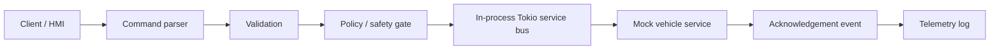

# Vehicle Command/Event Service Bus Design

This document defines the proposed Rust prototype design. The prototype is a
small, reviewable service-bus example rather than a production vehicle
platform.

## Prototype Overview

The service accepts vehicle commands, validates them, checks policy, routes
allowed commands to a mock vehicle service, emits acknowledgement events, and
records telemetry. The design mirrors the structure of a safety-conscious
command path without claiming Ford internal architecture or integrating with
real vehicle systems.

The core prototype runs locally without Docker and without a network broker.
MQTT is a future adapter around the same command/event flow, not a first-step
dependency.



## Design Principles

- Local-first development: the prototype must run with standard Rust tooling
  on a developer machine. Docker may be added as an optional packaging or
  integration-test convenience, but local execution must not depend on Docker.
- Typed APIs: commands, events, acknowledgements, and errors are explicit Rust
  types.
- Small service boundaries: parsing, validation, policy, transport, telemetry,
  and mock vehicle services remain separate.
- Transport abstraction: core logic does not depend directly on MQTT, a broker,
  or any specific network transport.
- Safety gate first: commands are validated and policy-checked before reaching
  mock vehicle services.
- Idempotency: duplicate `command_id` values are rejected or treated
  deterministically.
- Deadline-aware: stale commands expire before execution.
- Observable by default: command lifecycle events are logged with correlation
  IDs.
- TDD-friendly: business rules are easy to test without a network server.
- Two-hour scope: the first implementation demonstrates judgment, not
  production completeness.

## Design Goals

- Typed command and event APIs.
- Clear separation of validation, policy, routing, execution, telemetry, and
  errors.
- Async routing with predictable shutdown and dropped-receiver behavior.
- Explicit acknowledgement events.
- Testable duplicate detection, expiry handling, unsafe-state blocking, and
  telemetry emission.
- No Docker, broker, or network server prerequisite for local development.

## Phase 1 Architecture Confirmation

Phase 1 deliberately uses a local-first, broker-free architecture. This is a
design choice, not a limitation. The first prototype should demonstrate Rust
service design clearly before adding any external messaging technology.

Phase 1 intentionally uses:

- Local-first execution.
- No Docker requirement.
- No MQTT broker.
- No network server.
- In-process Tokio MPSC.
- Typed Rust command/event APIs.
- Policy and safety gate before execution.
- Acknowledgement events.
- Telemetry sink.
- Tests around validation, policy, async routing, and receiver-drop behavior.

## Non-Goals

- No real Ford, ECU, TCU, cloud, AAOS, CarPlay, Android Auto, or
  SmartDeviceLink integration.
- No MQTT client, MQTT broker, broker hardening, clustering, TLS,
  authentication, or authorization in the first prototype.
- No real D-Bus, gRPC, Protobuf, CAN, or Automotive Ethernet.
- No persistent database.
- No production authentication.
- No UI.
- No broad service framework.

## Module Design

| Module | Responsibility |
| --- | --- |
| `src/main.rs` | Minimal demonstration wiring the service bus and mock service. |
| `src/command.rs` | Command types, command envelope, parsing, and validation helpers. |
| `src/event.rs` | Event and acknowledgement types. |
| `src/service_bus.rs` | Async command routing, channel ownership, and receiver behavior. |
| `src/policy.rs` | Policy decisions, safety gate, and duplicate command tracking. |
| `src/telemetry.rs` | Telemetry event abstraction and in-memory test sink. |
| `src/transport.rs` | Transport abstraction and first `InProcessTransport` implementation. |
| `src/error.rs` | Typed error model for validation, policy, routing, and execution failures. |
| `tests/command_flow_tests.rs` | End-to-end command flow tests. |

## Phase 1 Implementation Estimate

The Phase 1 prototype is expected to be approximately 500-900 lines of Rust
across the planned modules and tests.

With Codex assistance, this should be a 2-4 hour implementation. Without
assistance, it is more likely a 4-6 hour implementation.

The intent is not to build a framework. The intent is to demonstrate clean Rust
service design, typed APIs, async command routing, validation, policy gates,
acknowledgement events, telemetry, and testability.

Rough sizing:

```text
Cargo/project setup: 30-50 LOC
command.rs:         80-150 LOC
event.rs:           40-80 LOC
error.rs:           40-80 LOC
policy.rs:          80-150 LOC
transport.rs:       80-150 LOC
service_bus.rs:     100-180 LOC
telemetry.rs:       60-120 LOC
main.rs:            40-80 LOC
tests:              150-300 LOC
```

## Command Model

The command envelope carries enough information for validation, policy,
correlation, and acknowledgement:

```text
Command {
    command_id
    command_type
    issued_at
    deadline
    payload
}
```

Command types:

- LockDoors.
- UnlockDoors.
- StartClimate.
- SetNavigationDestination.
- RequestVehicleHealth.

Validation rejects empty command IDs, unknown command types, expired deadlines,
and missing payload fields required by the command type.

## Event Model

The acknowledgement event preserves the command identity and final command
status:

```text
CommandAcknowledged {
    command_id
    command_type
    status
    reason
}
```

Status values include accepted, rejected, blocked, executed, and failed. The
event model distinguishes validation rejection, policy rejection, and
execution failure because each status has different operational meaning.

## Policy and Safety Gates

The policy layer decides whether a valid command is allowed under current mock
vehicle state.

Policy inputs include:

- Vehicle moving or parked.
- Door state.
- Climate capability availability.
- Previously seen command IDs.
- Command deadline.

Policy decisions include allow, reject duplicate, reject expired, and block
unsafe state. The policy layer is separate from validation so that malformed
commands and unsafe commands produce distinct outcomes.

## Transport Abstraction Pattern

The design separates business logic from transport implementation:

```text
Business Logic
        |
Transport Interface
        |
Transport Implementation
```

The prototype can express that boundary with a trait similar to:

```rust
trait MessageTransport {
    async fn publish(&self, topic: &str, payload: &[u8]) -> Result<(), TransportError>;
    async fn subscribe(&self, topic: &str) -> Result<MessageStream, TransportError>;
}
```

The first implementation is `InProcessTransport`, backed by Tokio channels.
`MqttTransport` is a future adapter and should use the same command validation,
policy, acknowledgement, and telemetry path.

## Service Bus Design

The service bus owns async command routing. It accepts validated and allowed
commands, forwards them to a mock vehicle service, receives a result, and
returns or publishes an acknowledgement event.

Expected behavior:

- Preserve command IDs through the full flow.
- Handle dropped receivers without panicking.
- Make send failures visible through typed errors and telemetry.
- Avoid building a generic framework beyond the prototype's needs.

## Why The Prototype Uses An In-Process Service Bus

The first prototype intentionally uses Tokio MPSC rather than MQTT. This keeps
the work focused on Rust service design, async ownership, backpressure, typed
APIs, validation, policy gates, acknowledgement events, and telemetry.

| Capability | Tokio MPSC | MQTT |
| --- | --- | --- |
| Latency | Very low | Broker/network hop |
| Strong typing | Native Rust types | Serialized payloads |
| Setup | None | Broker required |
| Best fit | Service internals | Vehicle-to-cloud communication |
| Prototype suitability | Excellent | Future extension |

The first prototype focuses on service ownership and command flow. MQTT is
treated as a future transport adapter rather than a foundational dependency.

## Queue Design Principles

### Bounded Queues

Bounded channels are preferred wherever practical. They provide natural
backpressure, prevent unbounded memory growth, and make runtime behavior more
predictable.

### Typed Payloads

Commands and events should be Rust types rather than loosely structured
messages. Typed payloads improve compile-time safety, refactoring confidence,
and API clarity.

### Ownership

Each queue has multiple producers and a single logical consumer. The consumer
owns processing responsibility and delegates domain behavior to the appropriate
service.

Queue managers own channel creation, receive loops, queue metrics, error
logging, lifecycle management, and shutdown behavior. Business services own
validation, state mutation, command handling, execution decisions, and
persistence.

### Backpressure

Critical commands should use `send(...).await` rather than fire-and-forget
patterns. Dropping, timing out, or failing a send should be an explicit design
choice.

### Observability

Queues should expose queue depth, saturation, processing counts, failures, and
latency. These signals make asynchronous behavior diagnosable during tests and
local demos.

## Safety Gate Pattern

The command flow mirrors the Salus readiness and preflight pattern:

```text
Command
  -> validation
  -> policy check
  -> execution
```

Salus applies the same shape to execution decisions:

```text
Route
  -> profitability
  -> readiness
  -> preflight
  -> execution
```

For the vehicle command prototype, malformed, expired, duplicate, or unsafe
commands should stop before reaching the mock vehicle service.

## Phase 2: MQTT Adapter Extension

Phase 2 can add MQTT without changing the core command flow. MQTT represents a
vehicle-to-cloud style message boundary in the local architecture. It is not
used as in-process IPC, not required by the first prototype, and not treated as
a claim about Ford internal systems.

Topic shape:

```text
vehicle/{vin}/commands
vehicle/{vin}/command_ack
vehicle/{vin}/telemetry
vehicle/{vin}/health
```

Phase 2 should add:

```text
MqttTransport
MqttCommandSubscriber
MqttAcknowledgementPublisher
Optional broker-backed integration tests
Optional local broker run instructions
```

The flow becomes:

```text
MQTT broker
  -> vehicle/{vin}/commands
  -> MqttTransport
  -> command decode
  -> validation
  -> policy gate
  -> service bus
  -> mock vehicle service
  -> acknowledgement event
  -> vehicle/{vin}/command_ack
```

The same validation, policy, telemetry, and acknowledgement logic must remain
shared with `InProcessTransport`. MQTT must not bypass the Phase 1 command path.

## Recommended MQTT Client Decision

Recommended Phase 2 client: `rumqttc`.

Reasons:

- Pure Rust.
- Backed by a Tokio async event loop.
- Mature enough for a small adapter.
- Supports the likely local broker demo path.
- Does not require writing a broker.

Do not build an MQTT broker/server in Phase 2 unless explicitly requested.

## MQTT Server/Broker Options

### Option A - External Local Broker

Use a local broker such as Mosquitto or EMQX.

Best for:

- Fastest Phase 2.
- Realistic MQTT client behavior.
- Broker-backed integration tests.
- Keeping Rust code focused on adapter logic.

Expected effort:

```text
1-2 hours for broker run docs
3-5 hours for MqttTransport + tests
```

### Option B - Rust MQTT Server/Broker

Use a Rust server-capable library such as `mqtt-endpoint-tokio` or a broker
crate.

Best for:

- Demonstrating protocol/server implementation.
- Deeper MQTT internals.

Tradeoff:

- Much larger scope.
- Less relevant to Ford infotainment service design.
- Can distract from API, policy, and service boundaries.

Expected effort:

```text
6-12+ hours for a basic local server path
much longer for production-quality behavior
```

## Phase 2 Acceptance Criteria

Phase 2 is complete when:

```text
MqttTransport exists behind an optional feature or separate module
Phase 1 tests still pass without broker
broker-backed tests are opt-in
commands can be consumed from vehicle/{vin}/commands
acks can be published to vehicle/{vin}/command_ack
telemetry still works locally
MQTT does not bypass validation or policy
```

## Error Handling

Typed errors should represent:

- Validation failure.
- Duplicate command.
- Policy rejection.
- Service unavailable.
- Bus send failure.
- Execution failure.
- Acknowledgement failure.

Typed errors make tests precise and keep downstream callers from parsing
strings to understand behavior.

## Telemetry

The telemetry abstraction records events that matter during debugging:

- Command received.
- Validation rejected.
- Policy blocked.
- Command routed.
- Acknowledgement emitted.
- Bus send failed.
- Receiver dropped.

An in-memory telemetry sink is sufficient for the prototype and keeps tests
deterministic.

## Testing Strategy

Primary tests:

- Valid lock command accepted.
- Expired command rejected.
- Duplicate `command_id` rejected.
- Unsafe command blocked by policy.
- Command produces acknowledgement event.
- Service bus handles dropped receiver without panicking.

Additional coverage can include missing navigation destination, telemetry
assertions, mock service failure, and command ID preservation through the full
flow.

Future MQTT integration tests should be separated from unit tests because they
require a broker. They should verify that a command published to
`vehicle/{vin}/commands` produces an acknowledgement on
`vehicle/{vin}/command_ack`.

## Local Execution Model

The local developer path should be:

```text
cargo test
cargo run --bin infotainment-bus
```

`cargo test` should not require a broker, Docker, or any network server.
Broker-backed tests can be added later behind an explicit feature, ignored
test marker, or integration command so local development remains fast and
deterministic.

## Phase 1 Completion Criteria

Phase 1 is complete when:

```text
cargo test passes
cargo run works locally
no broker is required
no Docker is required
typed APIs are clear
policy and safety gates are tested
acknowledgements are emitted
telemetry is visible
receiver-drop behavior is safe
```

## Future Extensions

Potential future adapters:

- MQTT with `rumqttc`.
- D-Bus.
- gRPC.
- NATS.
- Kafka.

The initial prototype intentionally avoids these adapters to maintain a
two-hour implementation scope. It demonstrates service architecture, ownership
boundaries, validation, observability, safety gates, and queue behavior rather
than broker technology selection.

## Appendix: Relevant Libraries and Documentation

These links support future extension and design discussion. The first
implementation should remain broker-free and should only require `cargo test`
and `cargo run`.

### Core Prototype

- Tokio - async runtime and MPSC channels:
  [https://tokio.rs/](https://tokio.rs/)
- Tokio MPSC docs:
  [https://docs.rs/tokio/latest/tokio/sync/mpsc/](https://docs.rs/tokio/latest/tokio/sync/mpsc/)
- thiserror - typed Rust errors:
  [https://docs.rs/thiserror/](https://docs.rs/thiserror/)
- tracing - structured Rust telemetry:
  [https://docs.rs/tracing/](https://docs.rs/tracing/)
- serde - optional JSON serialization:
  [https://serde.rs/](https://serde.rs/)

### Optional MQTT Adapter

MQTT is not required for the first prototype. These are future adapter options
only. Do not make MQTT dependencies part of Phase 1.

| Library | Link | Phase 2 Use |
| --- | --- | --- |
| `rumqttc` | [https://docs.rs/rumqttc/latest/rumqttc/](https://docs.rs/rumqttc/latest/rumqttc/) | Recommended MQTT client adapter. |
| `mqrstt` | [https://docs.rs/mqrstt/](https://docs.rs/mqrstt/) | Alternative pure Rust MQTT client, useful if MQTT v5-specific behavior is desired. |
| `mqtt-protocol-core` | [https://docs.rs/mqtt-protocol-core/](https://docs.rs/mqtt-protocol-core/) | Protocol-level Sans-I/O library; useful for low-level protocol work, not needed for adapter-first Phase 2. |
| `mqtt-endpoint-tokio` | [https://docs.rs/mqtt-endpoint-tokio/](https://docs.rs/mqtt-endpoint-tokio/) | Tokio client/server endpoint library; consider only if server-side MQTT behavior becomes a goal. |

Notes:

- `rumqttc` is the preferred Phase 2 client adapter.
- `mqtt-endpoint-tokio` is interesting for client/server endpoint work but is
  more than the first MQTT extension needs.
- `mqtt-protocol-core` is lower-level and useful if protocol parsing or custom
  broker behavior becomes a learning goal.
- Do not make MQTT dependencies part of Phase 1.

### Optional Future Transports

- D-Bus specification:
  [https://dbus.freedesktop.org/doc/dbus-specification.html](https://dbus.freedesktop.org/doc/dbus-specification.html)
- gRPC Rust docs:
  [https://grpc.io/docs/languages/rust/](https://grpc.io/docs/languages/rust/)
- Protocol Buffers:
  [https://protobuf.dev/](https://protobuf.dev/)
- NATS Rust client:
  [https://docs.rs/async-nats/](https://docs.rs/async-nats/)
- Kafka Rust client:
  [https://docs.rs/rdkafka/](https://docs.rs/rdkafka/)
