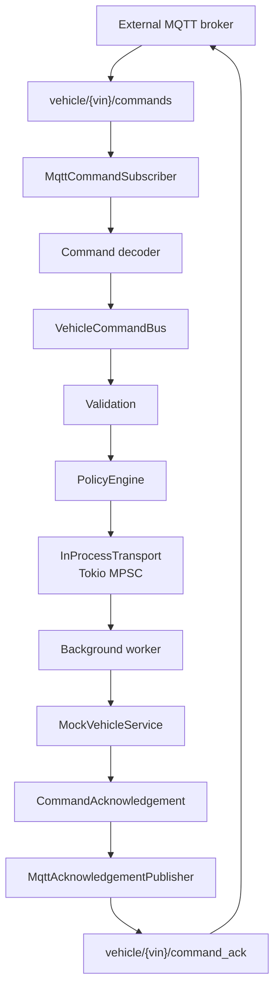

# Prototype Implementation Notes

This document records the completed Phase 1 implementation and the boundaries
for Phase 2. The prototype remains a small, reviewable Rust service-bus example
rather than a production vehicle platform.

## Phase 1 Status

Phase 1 is complete.

Implemented:

- Rust 2024 crate at the repository root.
- Library-first architecture through `src/lib.rs`.
- Thin demonstration executable in `src/main.rs`.
- Typed command model.
- Command validation.
- Typed error model.
- Policy engine.
- Typed acknowledgement model.
- `InProcessTransport`.
- Bounded Tokio MPSC channel.
- `BusMessage`.
- `oneshot` acknowledgement channel.
- `VehicleCommandBus`.
- Background worker.
- `MockVehicleService`.
- `VehicleEvent` and `VehicleEventKind`.
- Shared `InMemoryTelemetry`.
- Unit and integration tests.

Not required in Phase 1:

- Docker.
- MQTT.
- MQTT broker.
- Network server.
- Real vehicle, ECU, CAN, TCU, cloud, AAOS, CarPlay, Android Auto, or
  SmartDeviceLink integration.

## Completed Build Sequence

1. Created the root-level Rust project.
2. Added command and error types.
3. Added validation tests and validation logic.
4. Added policy decisions and duplicate tracking.
5. Added event and acknowledgement types.
6. Added `InProcessTransport` and `BusMessage`.
7. Added async service bus routing.
8. Added mock vehicle service behavior.
9. Added shared in-memory telemetry.
10. Added end-to-end command flow tests.
11. Refactored documentation to match the implementation.

## Current Files

```text
Cargo.toml
src/lib.rs
src/main.rs
src/command.rs
src/error.rs
src/event.rs
src/policy.rs
src/service_bus.rs
src/telemetry.rs
src/transport.rs
tests/command_tests.rs
tests/events_test.rs
tests/policy_tests.rs
tests/service_bus_tests.rs
tests/telemetry_tests.rs
tests/transport_tests.rs
```

The repository uses root-level `src/` and `tests/` for Rust code. It does not
use `docs/src`.

## Module Responsibilities

| Module | Responsibility |
| --- | --- |
| `src/lib.rs` | Library entry point exporting reusable prototype modules for tests and executables. |
| `src/main.rs` | Thin demonstration executable; Phase 2 can evolve it into a `clap` CLI while business logic remains in the library. |
| `src/command.rs` | `CommandType`, `Command`, command construction, expiry helper, and command validation. |
| `src/error.rs` | `CommandError` variants for validation, policy, bus send, service, and acknowledgement failures. |
| `src/event.rs` | `CommandAcknowledgement` and `CommandStatus` types used to report command outcomes. |
| `src/policy.rs` | `VehicleState` and `PolicyEngine`; tracks duplicate command IDs and blocks unsafe unlock while moving. |
| `src/service_bus.rs` | `VehicleCommandBus`, `MockVehicleService`, background worker orchestration, acknowledgement handling, and telemetry recording. |
| `src/telemetry.rs` | `VehicleEvent`, `VehicleEventKind`, and shared `InMemoryTelemetry` backed by `Arc<Mutex<Vec<VehicleEvent>>>`. |
| `src/transport.rs` | `BusMessage` and `InProcessTransport` using bounded Tokio MPSC plus oneshot acknowledgement channels. |

## Dependencies

Current dependencies:

- `tokio` with `sync`, `macros`, and `rt` features for async tests, MPSC,
  oneshot channels, and the current-thread demonstration runtime.
- `thiserror` for typed errors.

No MQTT dependency is present. No Docker dependency or broker setup is needed.

## Local Run Modes

Core mode requires only Rust tooling:

```text
cargo test
cargo run
```

`cargo run` executes the thin demonstration binary. It submits a sample
`LockDoors` command, prints the returned `CommandAcknowledgement`, and prints
recorded telemetry events.

## Command And Validation

`src/command.rs` defines:

- `CommandType`.
- `Command`.
- `Command::new`.
- `Command::expired`.
- `Command::validate`.

Implemented command types:

- `LockDoors`.
- `UnlockDoors`.
- `RequestVehicleHealth`.

Validation rejects:

- empty `command_id`.
- empty `vehicle_id`.
- expired deadlines.

## Error Model

`src/error.rs` defines typed `CommandError` variants for:

- missing command IDs.
- missing vehicle IDs.
- expired commands.
- unsafe state.
- duplicate command IDs.
- bus send failure.
- service unavailability.
- acknowledgement failure.

## Policy Gate

`src/policy.rs` defines `VehicleState` and `PolicyEngine`.

The policy engine:

- tracks seen command IDs.
- rejects duplicates.
- blocks `UnlockDoors` when `VehicleState::is_moving` is true.

Deadline checks remain in command validation. Policy handles valid commands
that may still be unsafe or duplicate.

## Event And Acknowledgement Model

`src/event.rs` defines `CommandAcknowledgement` and `CommandStatus`.

Statuses:

- `Accepted`.
- `Rejected`.
- `Blocked`.
- `Executed`.
- `Failed`.

The service bus currently returns executed acknowledgements for successful
worker execution, rejected acknowledgements for validation failures and
duplicates, blocked acknowledgements for unsafe policy decisions, and failed
acknowledgements for bus, service, or acknowledgement failures.

## Transport

`src/transport.rs` defines the current transport:

```text
InProcessTransport
```

using:

```text
Tokio MPSC
BusMessage
oneshot
```

`InProcessTransport::new(capacity)` creates a bounded channel and returns the
transport plus its receiver. `publish` sends a typed `BusMessage` and converts
send failure into `CommandError::BusSendFailed`.

`BusMessage` carries the command plus a oneshot acknowledgement sender. This
keeps the worker model asynchronous while preserving one response per command.

## Service Bus And Worker

`src/service_bus.rs` defines `VehicleCommandBus` and `MockVehicleService`.

Runtime flow:

```text
Command
    ↓
Validation
    ↓
Policy
    ↓
InProcessTransport (Tokio MPSC)
    ↓
Background Worker
    ↓
MockVehicleService
    ↓
CommandAcknowledgement
    ↓
VehicleEvent
    ↓
InMemoryTelemetry
```

The bus records command receipt, validation failures, policy blocks, routing,
bus send failures, and receiver-drop failures. The worker records successful
execution and acknowledgement emission.

## Telemetry And Observability

Telemetry is modeled with:

- `VehicleEvent`.
- `VehicleEventKind`.
- `InMemoryTelemetry`.

`VehicleEvent` is the domain event. `InMemoryTelemetry` records those events in
shared memory through a cloned sink, allowing both `VehicleCommandBus` and the
background worker to append to the same event list.

This is intentionally deterministic and test-friendly. It is not a production
logging or metrics subsystem.

## Implemented Tests

The current tests cover:

- Valid lock command construction.
- Missing command ID rejection.
- Missing vehicle ID rejection.
- Expired command rejection.
- Executed, rejected, and blocked acknowledgement creation.
- Valid policy decision.
- Duplicate command rejection.
- Unsafe unlock while moving blocked by policy.
- Transport publish to receiver.
- Transport failure when receiver is dropped.
- End-to-end service bus execution and acknowledgement.
- Expired command rejection before transport.
- Unsafe command blocking before transport.
- Duplicate command rejection through the bus.
- Telemetry lifecycle recording.
- Direct in-memory telemetry recording.

## Phase 1 Summary

Phase 1 is complete. The repository now contains a Rust 2024 project with
library-first architecture through `src/lib.rs`, a thin demo executable in
`src/main.rs`, a typed command model, command validation, typed error model,
command acknowledgement model, policy engine, shared in-memory telemetry,
`VehicleEvent`, `VehicleEventKind`, `InProcessTransport`, Tokio MPSC bounded
queue, `BusMessage`, `oneshot` acknowledgement channel, background worker,
`MockVehicleService`, integration tests, and a `cargo run` demo.

Phase 1 review validation passed:

- `cargo fmt --check`.
- `cargo build`.
- `cargo test`.
- `cargo run`.
- `git diff --check`.

The completed implementation remains broker-free, Docker-free, and
MQTT-free. Module boundaries match the design, validation and policy gates are
tested, acknowledgements are emitted, telemetry is recorded through
`InMemoryTelemetry`, receiver-drop behavior is safe, and the prototype avoids
claims about Ford internal systems.

## Phase 2: MQTT Adapter Extension

Recommended Phase 2: MQTT adapter around the existing service bus.

Phase 2 can add MQTT without changing the core command flow. It should add
MQTT as an external integration boundary around the same validation, policy,
acknowledgement, and telemetry logic used by the local prototype.

Phase 2 may add:

```text
MqttAdapter
MqttTransport
MqttCommandSubscriber
MqttAcknowledgementPublisher
Optional broker-backed integration tests
Optional local broker run instructions
```

`MqttAdapter` is the Slice 1 broker-free adapter boundary.
`MqttTransport` is reserved for Slice 2, when `rumqttc` is introduced and the
code performs actual broker communication.

## Phase 2 Implementation Sequence

### Slice 1 - Serialization And Adapter Interfaces

Slice 1 is complete. It prepared the MQTT adapter boundary without connecting
to a broker and without changing the completed Phase 1 service bus.

Implemented Slice 1 modules:

- `src/mqtt/mod.rs`.
- `src/mqtt/topics.rs`.
- `src/mqtt/adapter.rs`.

Implemented Slice 1 tests:

- `tests/serialization_tests.rs`.
- `tests/mqtt_topics_tests.rs`.
- `tests/mqtt_adapter_tests.rs`.

Completed Slice 1 work:

1. Added `serde`.
2. Serialized `Command`.
3. Serialized acknowledgements.
4. Created MQTT topic helpers.
5. Created `MqttAdapter`.
6. Created placeholder subscriber.
7. Created placeholder acknowledgement publisher.

Slice 1 remains broker-free and does not introduce `rumqttc`. It does not
modify `VehicleCommandBus`, move validation, policy, routing, worker
execution, acknowledgements, events, or telemetry into MQTT code, or add broker
configuration.

The new `MqttAdapter` types adapt external payloads into existing `Command`
values and use existing `CommandAcknowledgement` values for outbound
acknowledgements. Topic names are produced by helper functions rather than
duplicated as hard-coded strings.

Recommended Phase 2 architecture:



MQTT must not replace:

- `VehicleCommandBus`.
- validation.
- `PolicyEngine`.
- `InProcessTransport`.
- background worker.
- acknowledgements.
- `VehicleEvent`.
- telemetry.
- local broker-free tests.

MQTT should wrap the current architecture by converting external topic
messages into internal `Command` values and publishing resulting
acknowledgements back to MQTT.

Broker decision:

- Use an external local broker first.
- Recommended local broker: Mosquitto or EMQX.
- Recommended Rust client: `rumqttc`.
- Do not build a Rust MQTT broker/server in Phase 2.
- `mqtt-endpoint-tokio` remains future research only if server-side MQTT
  behavior becomes an explicit goal.
- Broker-backed tests should remain opt-in.

## CLI Evolution

The current executable is intentionally minimal. Phase 2 can evolve it into a
`clap`-based CLI capable of running demonstrations, submitting commands, and
exercising optional transport adapters.

The CLI must remain a wrapper around the library. Business logic must not move
into `main.rs`.

## Phase 2 Acceptance Criteria

Phase 2 is complete when:

```text
MqttTransport exists behind an optional feature or separate module
Phase 1 tests still pass without broker
broker-backed tests are opt-in
commands can be consumed from vehicle/{vin}/commands
acks can be published to vehicle/{vin}/command_ack
MQTT does not bypass validation
MQTT does not bypass policy
MQTT does not replace acknowledgements
MQTT does not replace telemetry
MQTT wraps the service-bus architecture
```

## Future Extensions

Potential future adapters:

- MQTT using `rumqttc`.
- D-Bus.
- gRPC.
- NATS.
- Kafka.

These extensions should remain transport adapters. They should not replace the
core validation, policy, queue ownership, acknowledgement, or telemetry model.
