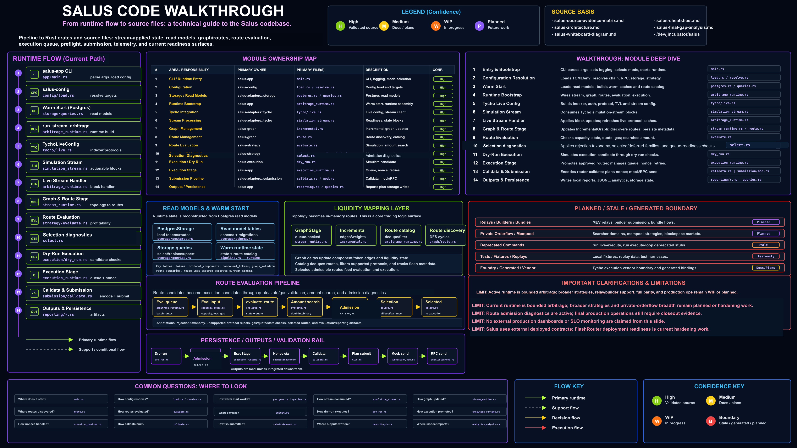

# Salus Walkthrough

This section describes Salus as a transferable Rust systems project. Salus is
not an automotive platform; its relevance is the design discipline behind
runtime ownership, queueing, readiness checks, safe execution, telemetry, and
failure handling.

## System Overview

Salus is a high-performance Rust execution platform with explicit service and
runtime boundaries. Work is accepted through defined interfaces, queued,
validated, executed through controlled paths, and recorded through telemetry.
That structure provides a useful comparison point for infotainment services
that must process HMI requests, command events, vehicle state, diagnostics,
and acknowledgements.

The architecture view shows a system organized around explicit
responsibilities rather than a single opaque execution path. That decomposition
is useful for reviewing how Rust services can isolate API contracts, runtime
ownership, state access, and operational signals.

## Runtime Responsibilities

The runtime owns task execution, queue consumption, cancellation behavior,
state access, readiness checks, execution boundaries, telemetry emission, and
failure propagation.

Explicit ownership prevents hidden coupling. A reviewer can identify which
component receives work, which component decides readiness, which component
executes side effects, and which component records the outcome.

## Queue and Backpressure Model

Queue design controls ordering, capacity, throughput, retry behavior, and
failure modes. In a vehicle command/event path, the same concerns appear as
command deadlines, duplicate command IDs, acknowledgement latency, dropped
receivers, telemetry fan-out, and degraded operation under load.

Backpressure should be observable. Queue depth, dropped messages, delayed
acknowledgements, and timeout rates are part of the operating model.

## Readiness and Safety Gates

Salus readiness and preflight patterns demonstrate a general rule: side
effects should not occur until prerequisites are known to be valid. In an
infotainment service, that maps to command validation, authorization and policy
decisions, vehicle state freshness, capability readiness, deadline checks,
duplicate command detection, and vehicle-owned safety boundaries.

## Safe Execution Boundaries

Salus separates planning and validation from execution. That boundary is
important in any system where side effects matter.

For vehicle-facing services, the same principle means HMI and projected apps
should not directly control ECUs. Commands should pass through service APIs,
policy gates, vehicle middleware, and auditable capability boundaries.

## Telemetry and Diagnostics

The runtime walkthrough image illustrates staged execution. Each stage can
emit telemetry, expose health, and preserve enough context to explain behavior
after success, rejection, timeout, or failure.

Useful telemetry includes command IDs, correlation IDs, queue latency,
acknowledgement latency, readiness failures, policy rejections, execution
status, and service health.

## Failure Handling

Failure handling should be explicit in the API and visible in telemetry.
Relevant failure classes include:

- Invalid command shape.
- Expired request.
- Duplicate command ID.
- Unsafe or unavailable vehicle state.
- Dependency not ready.
- Queue send failure.
- Receiver shutdown.
- Execution failure.
- Lost or delayed acknowledgement.

The system is easier to test and operate when these states are named rather
than collapsed into generic errors.

## Transferable Lessons for Infotainment Services

| Salus design lesson | Infotainment service implication |
| --- | --- |
| Strong boundaries reduce coupling. | Keep HMI, validation, policy, routing, execution, and telemetry separate. |
| Async ownership must be explicit. | Services should own tasks, cancellation, shutdown, and channel behavior. |
| Queues need semantics. | Capacity, ordering, retry, and backpressure are part of the API contract. |
| Readiness checks prevent unsafe actions. | Vehicle commands need state freshness and capability readiness checks. |
| Telemetry belongs in the design. | Diagnostics and audit trails should exist for success and failure paths. |
| Domain analogies need limits. | Salus transfers systems patterns, not automotive domain equivalence. |

The domain boundary remains important. Salus provides evidence of Rust systems
design judgment, not a claim of automotive equivalence or Ford internal
architecture knowledge.
